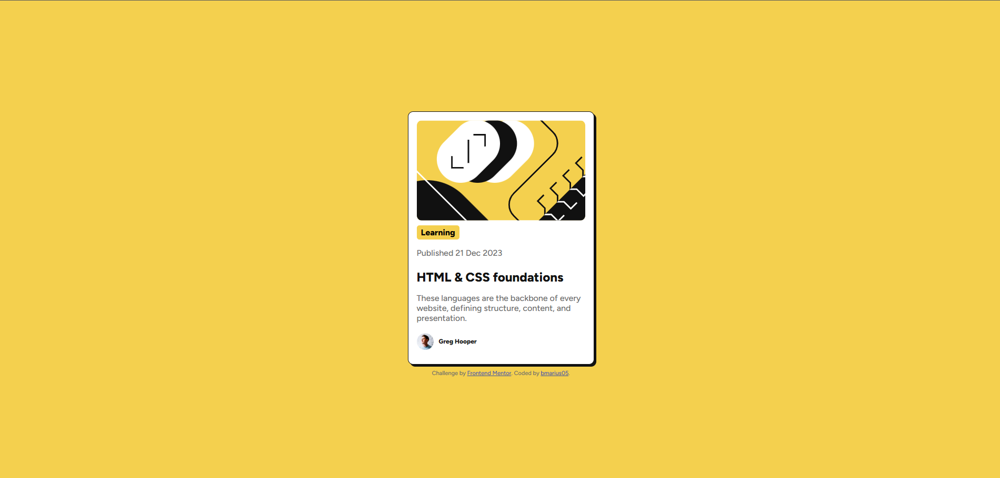

# Frontend Mentor - Blog preview card solution

This is a solution to the [Blog preview card challenge on Frontend Mentor](https://www.frontendmentor.io/challenges/blog-preview-card-ckPaj01IcS). Frontend Mentor challenges help you improve your coding skills by building realistic projects. 

## Table of contents

- [Overview](#overview)
  - [The challenge](#the-challenge)
  - [Screenshot](#screenshot)
  - [Links](#links)
- [My process](#my-process)
  - [Built with](#built-with)
  - [What I learned](#what-i-learned)
  - [Continued development](#continued-development)
- [Author](#author)

**Note: Delete this note and update the table of contents based on what sections you keep.**

## Overview

### The challenge

Users should be able to:

- See hover and focus states for all interactive elements on the page

### Screenshot



### Links

- Solution URL: [Git Repo](https://github.com/bmarius05/FrontendMentorBlogCard)
- Live Site URL: [Git page](https://bmarius05.github.io/FrontendMentorBlogCard/)

## My process

### Built with

- Semantic HTML5 markup
- CSS custom properties
- Flexbox


### What I learned

I learned how to use difrent flexbox directions. For instance hte image has to be centered but the text and the author should be aligned to the left.

```css
.card{
    background-color: var(--White);
    border-radius: 10px;
    width: 20rem;
    height: 28rem;
    padding: 1rem;
    display: flex;
    flex-direction: column;
    border: 1px solid var(--Gray-950);
    box-shadow: 4px 4px 0 0 var(--Gray-950);
    overflow: hidden;
}
```

### Continued development
In the future I want to improve my artistic eye to be able to create amazing designs on my own.

## Author

- Frontend Mentor - [@bmarius05](https://www.frontendmentor.io/profile/bmarius05)
- Twitter - [@bmarius05](https://x.com/bmarius05)
